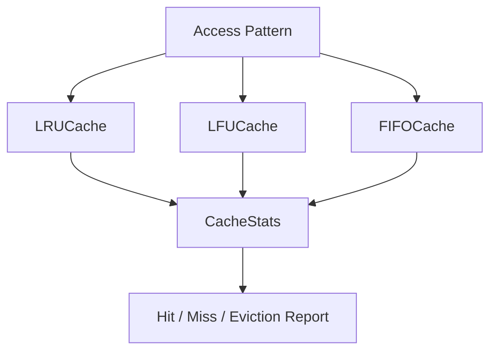

# Cache Simulator — Multi-Policy Eviction Engine (C++)

> A from-scratch cache simulator implementing three industry-standard eviction policies — LRU, LFU, and FIFO — with O(1) get/put operations and a built-in benchmarking harness.

**Highlights**
- Three eviction policies, **each with true O(1) `get`/`put`** — no linear scans, no sorting, no shortcuts
- LFU implemented the "hard way": hash map + per-frequency doubly linked lists + a `minFreq` pointer, not a heap or sorted structure
- Benchmarked head-to-head on an identical **10,000-operation, 80/20 locality-weighted access pattern** — same workload, same capacity, only the eviction logic differs
- **LFU beats FIFO by ~7.5 percentage points** in hit ratio (81.24% vs 73.69%) on that benchmark, with LRU close behind at 81.13%
- Instrumented with a dedicated stats layer tracking hits, misses, and evictions per policy for direct, reproducible comparison

---

## Table of Contents
- [Overview](#overview)
- [Core Architecture](#core-architecture)
- [Eviction Policies](#eviction-policies)
- [Stats Instrumentation](#stats-instrumentation)
- [Performance Comparison](#performance-comparison)
- [Complexity Guarantees](#complexity-guarantees)
- [Sample Output](#sample-output)
- [Build and Run Instructions](#build-and-run-instructions)
- [Roadmap](#roadmap)

---

## Overview

This project implements the classic cache-eviction problem from first principles: given a fixed-capacity cache, decide what to evict when a new key arrives and the cache is full. Rather than build one policy, this simulator implements **three** — Least Recently Used (LRU), Least Frequently Used (LFU), and First-In-First-Out (FIFO) — behind a common interface, then drives all three through the same access pattern so their behavior can be measured and compared directly rather than argued about in the abstract.

The emphasis throughout is on **O(1) operations**. Every policy achieves constant-time `get` and `put` using combinations of hash maps and doubly linked lists, avoiding the O(log n) or O(n) costs that naive implementations (sorted structures, linear scans for "least used") would incur.

---

## Core Architecture



| Component | Function |
|---|---|
| **LRUCache** | Hash map + doubly linked list with sentinel head/tail nodes; evicts the tail on overflow |
| **LFUCache** | Hash map of keys → nodes, hash map of frequencies → doubly linked lists, plus a `minFreq` tracker; evicts from the list at `minFreq` |
| **FIFOCache** | Hash map + plain queue; evicts strictly in arrival order, no recency or frequency awareness |
| **CacheStats** | Per-policy counters for hits, misses, and evictions, with a `print()` method for reporting |

The codebase is organized with a proper header/source split — `include/` for class declarations, `src/` for implementations — so each policy is a compilation unit in its own right rather than one monolithic file.

---

## Eviction Policies

### LRU (Least Recently Used)

**Status: Done, verified.**

A hash map from key → node paired with a doubly linked list ordered by recency. Sentinel (dummy) head and tail nodes eliminate boundary null-checks on insert/remove. On every `get` or `put`, the accessed node is moved to the front; on overflow, the node at the tail — the least recently used — is evicted.

### LFU (Least Frequently Used)

**Status: Done, verified.**

The most involved of the three. A single ordering isn't enough here because frequency and recency are independent axes, so LFU needs **three structures working together**: a hash map from key → node, a hash map from frequency → doubly linked list of nodes at that frequency, and a `minFreq` integer tracking the current lowest frequency bucket. On overflow, the least-recently-used node *within* the `minFreq` bucket is evicted — ties in frequency are broken by recency.

### FIFO (First-In-First-Out)

**Status: Done, verified.**

The simplest policy — a hash map plus a plain queue, no list-plus-iterator machinery required. Keys are evicted in strict arrival order regardless of how often or how recently they were accessed, which is exactly why it performs worst on a locality-weighted workload: it has no way to protect a "hot" key from eviction.

---

## Stats Instrumentation

Each policy carries its own `CacheStats` instance, recording:
- **Hits** — incremented in `get` on a successful lookup
- **Misses** — incremented in `get` on a lookup miss
- **Evictions** — incremented in `put`, and only in the branch where an eviction actually occurs (a common bug source: recording an eviction even when the cache still had room)

This turns the project from three isolated data structures into an actual **simulator** — a shared access pattern is fed through all three policies, and their stats are compared side by side.

---

## Performance Comparison

Benchmarked on a single shared access pattern: **10,000 operations, 80/20 hot/cold key distribution** (a small set of "hot" keys accessed with high locality, simulating realistic cache/memory access behavior), same capacity across all three policies.

| Policy | Hits | Misses | Evictions | Hit Ratio | Miss Ratio |
|---|---|---|---|---|---|
| **LFU** | 8,124 | 1,876 | 1,861 | **81.24%** | 18.76% |
| **LRU** | 8,113 | 1,887 | 1,872 | 81.13% | 18.87% |
| **FIFO** | 7,369 | 2,631 | 2,616 | 73.69% | 26.31% |

**LFU edges out LRU** (81.24% vs 81.13%) — expected, since with a small hot-key set and strong locality, recency and frequency largely capture the same working set. **Both comfortably beat FIFO** by ~7.5 points, since FIFO is structurally blind to access patterns — it evicts by arrival order alone, with no mechanism to protect a frequently- or recently-used key.

*A separate phase-segmented "scan-flood" experiment — bursts of one-off cold accesses designed to pollute the cache — showed LFU's resilience even more starkly (0 misses vs LRU's 5 in the flood phase), since LFU's frequency memory persists through a flood in a way LRU's pure recency signal doesn't.*

---

## Complexity Guarantees

| Policy | `get` | `put` | Space |
|---|---|---|---|
| LRU | O(1) | O(1) | O(capacity) |
| LFU | O(1) | O(1) | O(capacity), ~2–3x constant factor from auxiliary frequency maps |
| FIFO | O(1) | O(1) | O(capacity) |

All three achieve constant-time operations by construction — no policy ever scans the cache to decide what to evict; the data structure itself always has the eviction candidate at a known location (the tail, the `minFreq` bucket's tail, or the queue front).

---

## Sample Output

```
--- LRU Stats ---
Hits: 8113
Misses: 1887
Evictions: 1872
Hit Ratio: 81.13%
Miss Ratio: 18.87%

--- LFU Stats ---
Hits: 8124
Misses: 1876
Evictions: 1861
Hit Ratio: 81.24%
Miss Ratio: 18.76%

--- FIFO Stats ---
Hits: 7369
Misses: 2631
Evictions: 2616
Hit Ratio: 73.69%
Miss Ratio: 26.31%
```

---

## Build and Run Instructions

### Prerequisites
- **Compiler:** g++ with C++17 support (MinGW on Windows, or any standard g++/clang on Linux/macOS)
- **No external dependencies** — pure STL (`unordered_map`, list-based nodes)

### Build and Run
```bash
g++ -std=c++17 -o simulator src/main.cpp src/LRUCache.cpp src/LFUCache.cpp src/FIFOCache.cpp -I include
./simulator      # or simulator.exe on Windows cmd.exe
```

Run this from the project root — every `.cpp` file with real implementations must be listed explicitly at link time, since the header/source split means declarations and definitions live in separate files.

---
